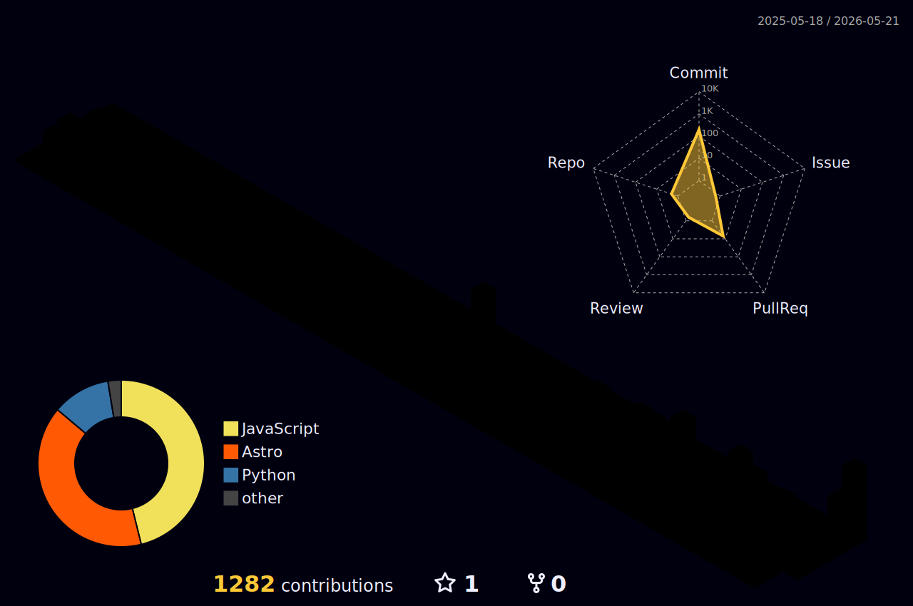

`Product & AI Prototyper` | `Data & AI @ Telefonica` | `Madrid, Spain`

---

---

<!-- BENTO GRID -->
<table>
<tr>
<td width="50%" valign="top">

### About me

I love building things that are useful and make people's lives easier.

Currently working on an innovation and prototyping team at **Telefonica**, where I focus on bringing AI breakthroughs into real products and use cases.

**Currently learning:** AI Agents frameworks, LLM Fine-tuning & evaluation, AI product design, agent orchestration.

**2026 Focus:** Contributing to AI projects with real-world impact and staying on top of emerging technologies in the ecosystem.

> *"I love mountains so much that sometimes I hike beyond my limits, but they always spark ideas for new projects :)"*

</td>
<td width="50%" valign="top">

### GitHub Stats

</td>
</tr>
<tr>
<td width="50%" valign="top">

### Tech Stack

</td>
<td width="50%" valign="top">

### Profile Summary

</td>
</tr>
<tr>
<td colspan="2" align="center">

### 3D Contribution Calendar

</td>
</tr>
<tr>
<td width="50%" valign="top">

### Coding Activity

<!--START_SECTION:waka-->
<!--END_SECTION:waka-->

</td>
<td width="50%" valign="top">

### Metrics

</td>
</tr>
</table>

---

